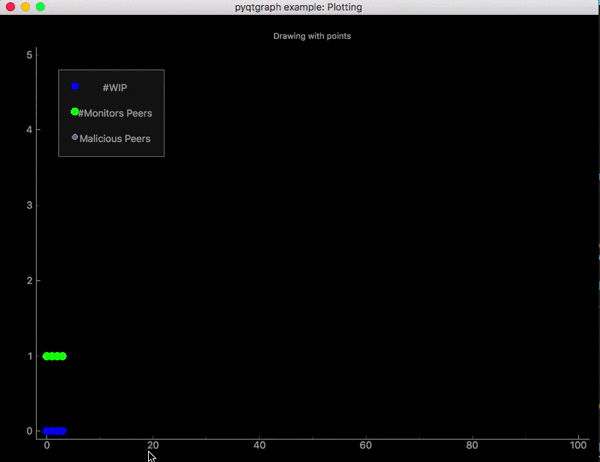
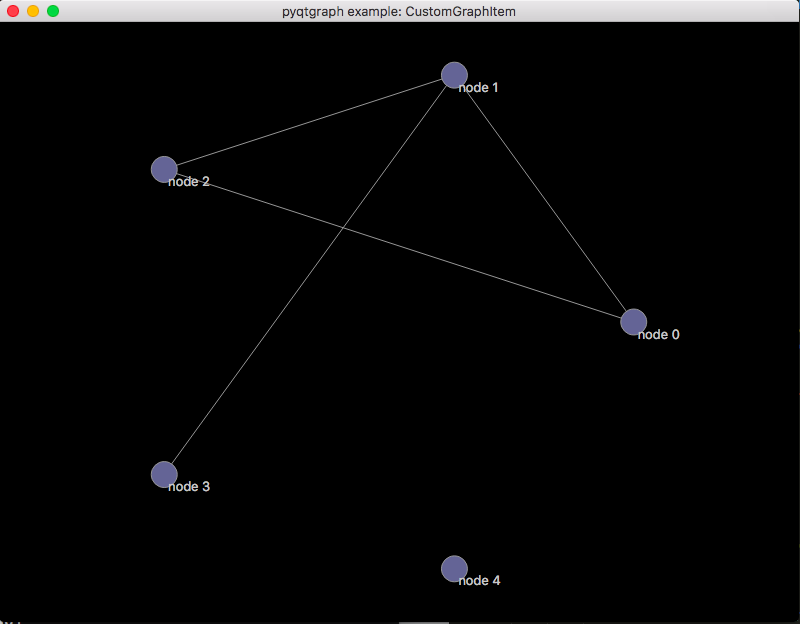

# PyQtGraph-Experiments
The purpose of this repository is to demonstrate plotting alternatives for the p2psp simulator. Since maplotlib is quite slow and sluggish and take quite much time for rendering.
[PyQtGraph](http://www.pyqtgraph.org/) is a very good alternative, as the sole purpose of using PyQtGraph is speed and improving real-time interactivity.
### Requirements
- pyqtgraph
- numpy
- PyQt 4.8+ or PySide
### Installation
 PyQtGraph use pyqt as backend so you would need to install pyqt.
 Visit [http://www.pyqtgraph.org/](http://www.pyqtgraph.org/) for other information.
 ### Results
##### Team Status 
 I already have implemented, the whole Team Status plotting method (inside play.py) in pyqtgraph. And results are amazing. Earlier graphs were even not rendering properly on my Macintosh but now it is plotting like butter. 
Execute following command to plot team status.
```sh
$ ./test.me
```


##### Network Overlay
I've implemented a network in pyqtgraph. You can find the implementation inside qtGraph.py. 
Execute 
```sh
$ python qtGraph.py
```

 
 I have just implement a static network yet. Complete implementation of Network Overlay is yet to be done.
 I'll done that very soon ...
